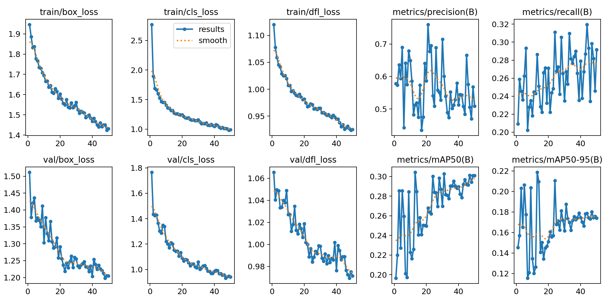
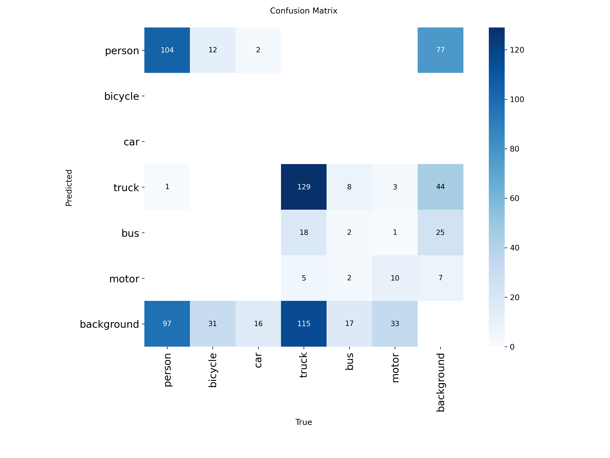

# 🛸 Autonomous Drone Vision – Deep Learning Exploration

A deep learning experiment applying **YOLOv8** to aerial imagery from the **VisDrone 2019 dataset**, aiming to detect vehicles and pedestrians from drone footage.

---

## 🎯 Objective
To develop a lightweight computer vision model capable of detecting and classifying common objects (e.g., *person*, *car*, *truck*, *bus*, *motorcycle*) in aerial drone scenes.  
The project demonstrates model training, data preparation, and evaluation — with skills transferable to automated risk analysis and quantitative modeling.

---

## 📦 Dataset
**VisDrone 2019 DET**  
- ~14,000 annotated drone images  
- Converted to YOLO format with a custom script (`convert_visdrone_to_yolo.py`)  
- Split: 80% training / 20% validation  
- Classes:

---

## ⚙️ Environment
| Component | Details |
|:--|:--|
| Hardware | MacBook Pro (M4, 16 GB RAM) |
| OS | macOS |
| Framework | PyTorch + Ultralytics YOLOv8 |
| Acceleration | MPS (Apple GPU backend) |
| Python | 3.14 (venv) |

---

## 🚀 Training Configuration

| Parameter | Value |
|:--|:--|
| Model | YOLOv8n (pretrained) |
| Epochs | 50 |
| Image size | 512×512 |
| Batch size | 4 |
| Device | MPS |

### 🧠 Training Command
yolo task=detect mode=train \
  model=yolov8n.pt \
  data=data/visdrone_yolo/data.yaml \
  epochs=50 imgsz=512 batch=4 device=mps \
  project=runs_drone_vision name=yolov8n_clean 

---

## 📊 Results Summary
| Metric | Score | Notes |
|:--|:--:|:--|
| mAP@50 | ≈ 0.30 | Solid baseline for YOLOv8n |
| mAP@50-95 | ≈ 0.18 | Consistent with aerial datasets |
| Precision | 0.55–0.70 | Stable |
| Recall | 0.25–0.30 | Gradually improving |

**Loss curves**  

**Confusion Matrix**

---

## 🧠 Insights
- Clean dataset structure and annotation consistency are crucial for YOLO training.  
- MPS backend on Apple Silicon performs well for small models.  
- Performance trade-off between model size (n, s, m) and precision.  
- The project provides a foundation for future work in **autonomous navigation** and **risk detection** systems.

---

## 🔮 Next Steps
- Retrain with `yolov8s.pt` and 100 epochs  
- Add augmentation (scale, hue, flip)  
- Build a **Gradio/Streamlit** demo for interactive inference  
- Integrate preview on [thinkboldwithanar.com](https://www.thinkboldwithanar.com)

---

## 📂 Repository Structure
drone-vision/
├── data/
│ ├── visdrone_yolo/
│ │ ├── images/
│ │ └── labels/
├── tools/
│ └── convert_visdrone_to_yolo.py
├── runs_drone_vision/
├── README.md
└── yolov8n.pt

---

### 🧩 Author
**Anar Bold**  
📍 Zurich, Switzerland  
🎓 MSc Physics (UZH) | Actuarial & Quantitative Analytics | AI/ML Enthusiast  
🌐 [thinkboldwithanar.com](https://www.thinkboldwithanar.com)

---

### 🏷️ License
This repository is for educational and research purposes only.  
Dataset © VisDrone 2019 authors. Model training and scripts © Anar Bold.

